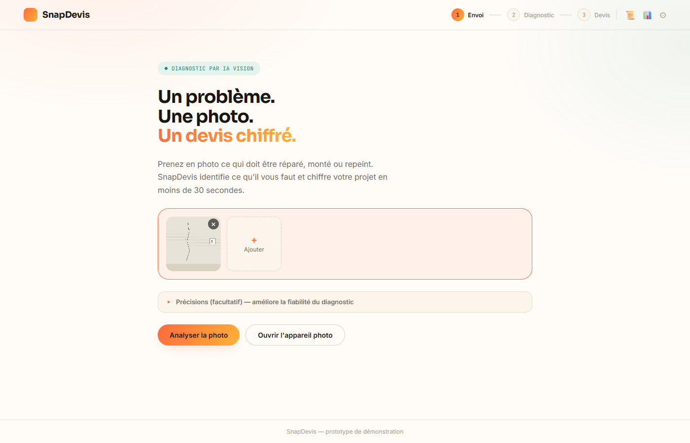
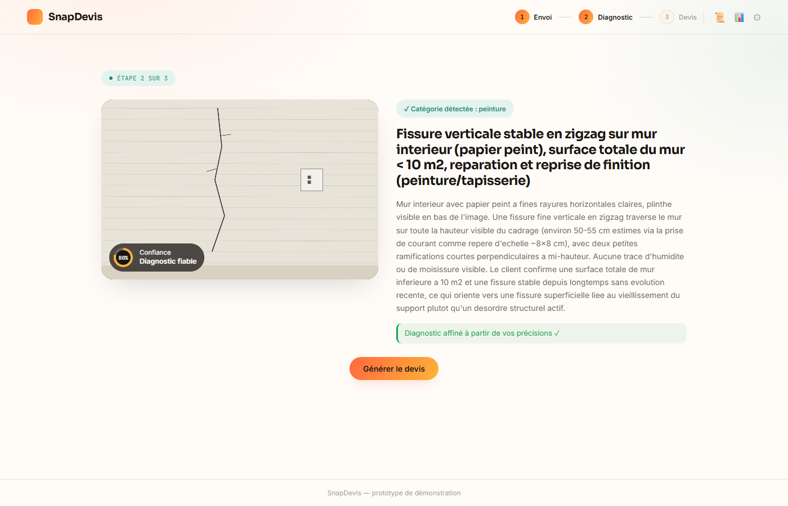
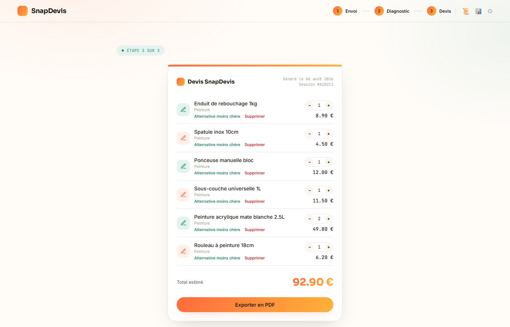

# SnapDevis

### Une photo. Un diagnostic. Un devis chiffré. En moins de 30 secondes.

SnapDevis est un agent IA qui transforme la photo d'un problème de bricolage — mur fissuré, robinet qui fuit, étagère à fixer — en un devis chiffré et détaillé, prêt à être utilisé en magasin ou en ligne.

---

## Le problème côté client

Un client qui a un problème chez lui (une fissure, une fuite, une prise électrique à changer) ne sait généralement pas :
- de quoi il a exactement besoin,
- en quelle quantité,
- combien ça va lui coûter.

Aujourd'hui, il doit soit se déplacer en magasin en espérant qu'un vendeur ait le temps de l'aider, soit deviner seul en rayon — avec le risque classique d'acheter trop (argent perdu) ou pas assez (deuxième déplacement).

**SnapDevis répond à cette question en une photo**, avant même que le client mette un pied en magasin.

---

## Comment ça marche, en 3 étapes

### 1. Le client envoie une photo

Il prend en photo ce qui doit être réparé, monté ou repeint. Il peut envoyer plusieurs photos (angles différents, gros plan sur un détail) et ajouter une précision en quelques mots si besoin — mais une seule photo suffit pour démarrer.

### 2. L'IA analyse la photo et pose les bonnes questions

L'IA observe la photo dans le détail, se sert des repères visibles (une prise électrique, une porte, un carrelage) pour estimer des dimensions réelles, et ne pose une question que si une information nécessaire au devis n'est vraiment pas déductible de l'image. Sur cet exemple réel : l'IA a identifié une fissure verticale, estimé sa longueur à ~50-55 cm à partir de la prise électrique visible sur la photo, et proposé des réponses rapides à choisir en un clic plutôt que de laisser le client deviner ce qu'il faut taper.

### 3. Le devis est généré, chiffré et modifiable

Une liste de produits réellement nécessaires (pas une liste générique), avec quantités calculées à partir de la conversation, prix, et pour chaque ligne une **alternative moins chère** suggérée automatiquement si elle existe. Le client peut ajuster les quantités, retirer une ligne, puis exporter le tout en PDF.

Sur cet exemple : 6 produits sélectionnés spécifiquement pour une fissure superficielle sur un mur de moins de 10 m², pour un total de 92,90 €.

---

## Ce qui rend le diagnostic fiable

- **Plusieurs photos, plusieurs angles** — combinés par l'IA pour un diagnostic plus complet qu'avec une seule image.
- **Pointer la zone exacte du problème** — le client peut indiquer précisément où se situe le souci sur la photo ; un zoom automatique de cette zone est envoyé en plus à l'IA pour un diagnostic plus précis, sans avoir à reprendre une nouvelle photo.
- **Questions ciblées, jamais de devinette** — si une information manque, l'IA repose une question chiffrée avec des choix concrets plutôt que d'estimer au hasard (une quantité surestimée fait payer le client pour rien ; une quantité sous-estimée l'oblige à revenir).
- **Alerte qualité photo** — une photo trop sombre ou floue est signalée, avec une correction automatique de la luminosité en un clic.

---

## Pourquoi c'est intéressant pour une enseigne

- **Un premier contact qualifié avant même la visite en magasin** — le client arrive avec un besoin déjà chiffré, ce qui accélère la vente et réduit le risque d'achat incomplet ou excessif.
- **Utilisable en self-service (site web, appli) ou comme outil d'aide à la vente en magasin** pour les conseillers.
- **Neutre et personnalisable** — l'identité visuelle actuelle (SnapDevis) est volontairement distincte de toute enseigne existante, pensée pour être déclinée en marque blanche.
- **Un tableau de bord interne** suit déjà l'usage : panier moyen, écart entre le produit principal et le devis complet, répartition par type de problème.

---

## Où en est le projet aujourd'hui

Ce que vous voyez ici est un **prototype de démonstration fonctionnel** — le parcours complet (photo → diagnostic → devis → export PDF) fonctionne réellement, avec une IA vision réelle et un catalogue de démonstration (42 produits fictifs, 5 catégories : peinture, plomberie, fixation, électricité, jardin).

Ce qui reste à faire pour un déploiement chez une enseigne : brancher le vrai catalogue produits, adapter la marque visuelle, et intégrer un vrai parcours de commande. C'est un travail d'intégration, pas de conception — la logique de diagnostic et de devis est déjà là et fonctionne.

---

*Document préparé pour présentation commerciale — SnapDevis, un projet Harington Technologies.*
